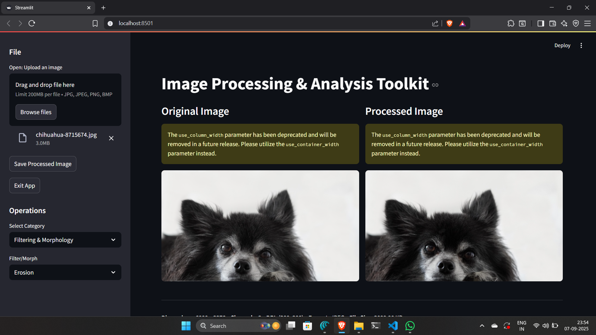

# Image Processing & Analysis Toolkit

A tiny, friendly Streamlit app to learn basic image processing with OpenCV — perfect for first-time beginners.



---

## What is this?
A simple web app that lets you upload an image and try common image operations (rotate, scale, blur, sharpen, edge detection, morphology) with interactive sliders — no setup headaches.

## Quickstart (5 steps)
1. Clone the repo.  
2. Create & activate a virtual environment:
   ```bash
   python -m venv .venv
   # macOS / Linux
   source .venv/bin/activate
   # Windows PowerShell
   .\.venv\Scripts\activate
Install dependencies:

pip install -r requirements.txt


Run the app:

streamlit run app.py


Open the URL shown in the terminal (usually http://localhost:8501).

Features (one-liner)

Upload images, preview original vs processed.

Color conversions, rotation, scaling, translation.

Filters: Gaussian / Median / Mean.

Morphology: dilation, erosion, opening, closing.

Edge detectors: Sobel, Laplacian, Canny.

Save processed images.
